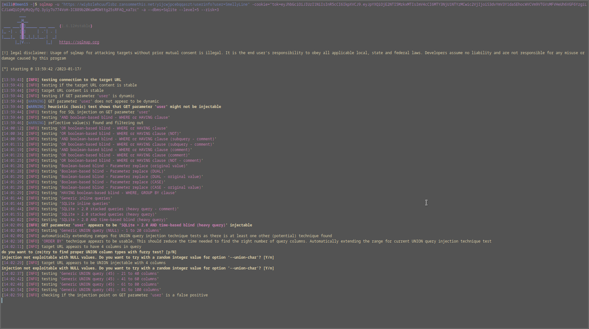
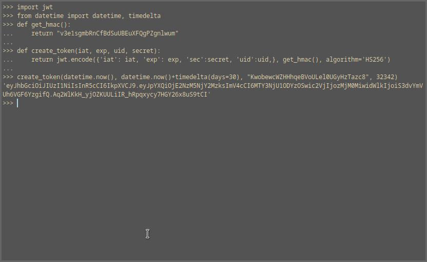

# Task 7
## Category: Web Hacking/Redacted
### Prompt:
With access to the site, you can access most of the functionality. But there's still that admin area that's locked off.

Generate a new token value which will allow you to access the ransomware site as an administrator.
### Provided Materials:
- None
### Task Goal:
- Admin JSON Web Token
### Steps:
The goal of this task is to find the sec and uid claims for an admin account, so the first step is to find a target.
Conveniently, there is a page called adminlist.html that lists former and currently online admins:


We know from the site's code that we gained access to in task b2 how tokens are created:

```python
def generate_token(userName):
        """ Generate a new login token for the given user, good for 30 days"""
        with userdb() as con:
                row = con.execute("SELECT uid, secret from Accounts WHERE userName = ?", (userName,)).fetchone()
                now = datetime.now()
                exp = now + timedelta(days=30)
                claims = {'iat': now,
                          'exp': exp,
                                  'uid': row[0],
                                  'sec': row[1]}
                return jwt.encode(claims, hmac_key(), algorithm='HS256')
```

This tells us that the data we need is stored in a SQLite database called userdb, which the path to can be found in util.py:

```python
@contextmanager
def userdb():
	userdb = f"/opt/ransommethis/db/user.db"
	try:
		con = sqlite3.connect(userdb)
		yield con
	finally:
		con.close()
```

Next I looked through the site for any place where the user has control of data being sent to the database, and the userinfo page stuck out:


While it doesn't initially appear like there is any control of the data from the page, but looking at the code we know there is a hidden user parameter:

```python
def userinfo():
	""" Create a page that displays information about a user """
	query = request.values.get('user')
```

This can also be discovered by brute forcing parameters in a situation without the backend code. Further down we see a glaring issue:

```python
	with util.userdb() as con:
		infoquery= "SELECT u.memberSince, u.clientsHelped, u.hackersHelped, u.programsContributed FROM Accounts a INNER JOIN UserInfo u ON a.uid = u.uid WHERE a.userName='%s'" %query
		row = con.execute(infoquery).fetchone()
```

This is a query using a non-parameterized and unsanitized query using data that the user controls (bad string interpolation). First I tried a test case on the app running locally to confirm that it was potentially vulnerable to injection:


Test Payload: RedundantIssue%27;%20SELECT%20*%20FROM%20Accounts;
Entry Point: user GET parameter

Expected Results: dumping the Accounts table
Actual Results (from test server):
```
  File "/home/revarch/Sources/flask/app/app.py", line 34, in userinfo
    row = con.execute(infoquery).fetchone()
sqlite3.Warning: You can only execute one statement at a time.
```

So I can rule out very basic SQL injection, but I can gather that my query is being processed. Then I tried some different payloads to coax out interesting behavior:

```
WEIRD BEHAVIOR:
1. ' or 'z'='z (content length: 4312)
2. {base}' or 7=7-- (content length: 4406)
3. {base}' or 'z'='z' or 'a'='b (content length: 4445)
4. {base}'/**/or/**/'z'='z (content-length: 4424)
```

Unforuntately all of the payloads I wrote to dump the Accounts table resulted in an error saying that only one query could be executed at a time, and SQLite doesn't have query stacking. I did manage to figure out by which username the page ended up displaying that my UID was lower than RedundantIssue, but that didn't help much.

After trying to write some manual payloads, I decided to use SQLMap and found it was a time based blind using heavy queries, which explains why my classic time based payloads weren't working as expected.



From SQLMap we learn that the site is running Nginx and that we are currently accessing the database as an admin. We can also see the tables mentioned in the code: Accounts and UserInfo. Dumping the Accounts table reveals the Sec and UID for RedundantIssue: KwobewcWZHHhqeBVoULel0UGyHzTazc8, 32342


From there it's as simple as using the same code used to generate a user token in task 6:




