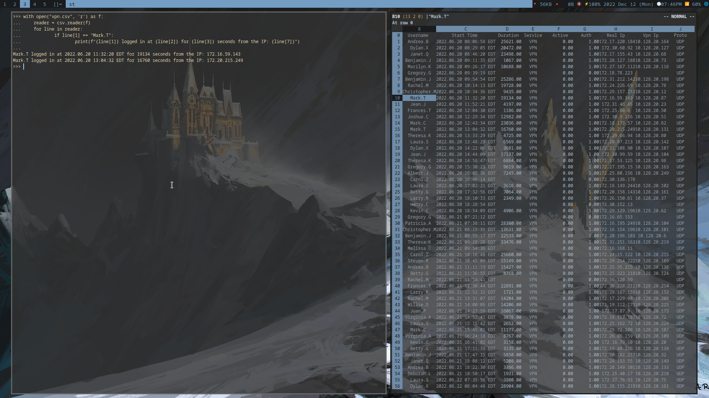
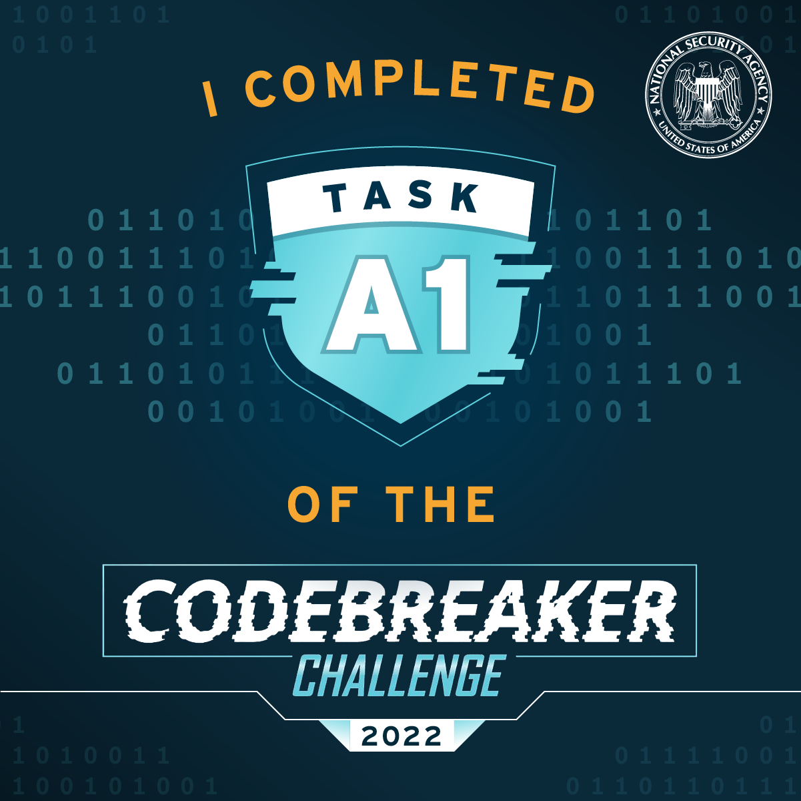

# Task A1
## Category: Initial Access/Log Analysis
### Prompt:
"We believe that the attacker may have gained access to the victim's network by phishing a legitimate users credentials and connecting over the company's VPN. The FBI has obtained a copy of the company's VPN server log for the week in which the attack took place. Do any of the user accounts show unusual behavior which might indicate their credentials have been compromised?
Note that all IP addresses have been anonymized."
### Provided Materials:
1. vpn logfile (vpn.log)
### Task Goal:
- Compromised Username
## Steps:
The VPN log file provided was a CSV separated list including access times, usernames, access duration, bytes transfered, etc.
My thought process was that since the attacker gained access via phishing, it would be safe to rule out any failed logins as it wouldn't make since for a login to fail if the credentials are already known.

This task was a bit of a guessing game, as the nature of "unusual behavior" is a bit unclear. My first guess was to check extremely large transfers of bytes out, as that would indicate to me that the attacker is exfiltrating data as they snoop around the compromised machine. Unfortunately, the top 3 highest values in that category were all legitimate.

Rethinking the method of attack helped: since the credentials were acquired by phishing, it would make sense that the times would be overlapping. Typically the worker would fall for the fake login page, immediately log in to the real one once they are redirected, and then the attacker would log in as well. This turned out to be correct as one user has overlapping sessions from different IP addresses:

