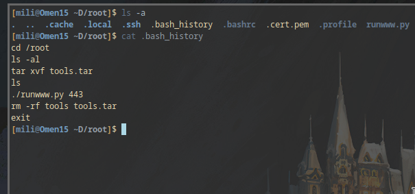
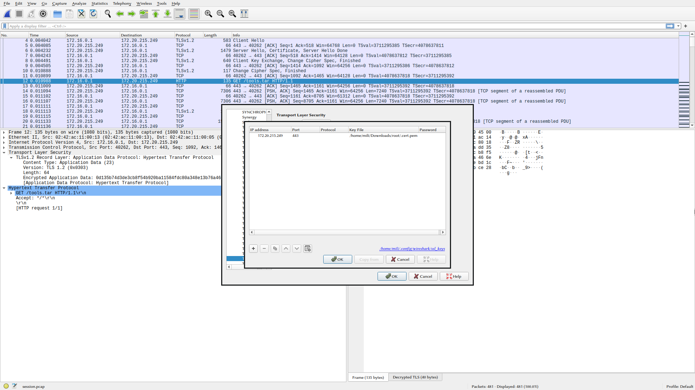
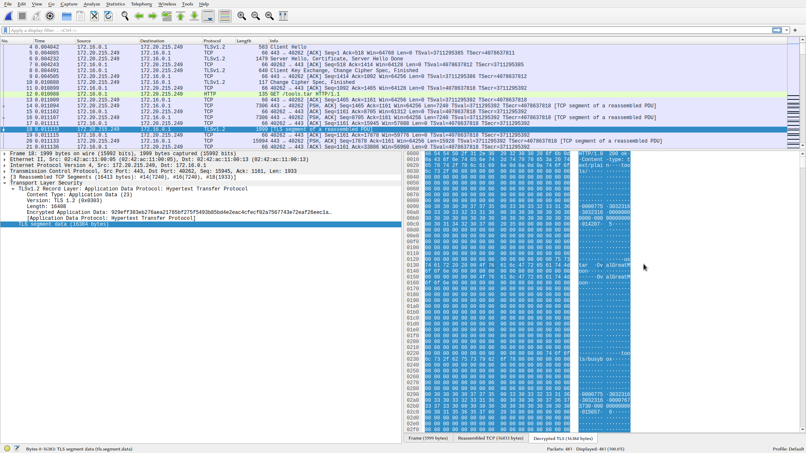
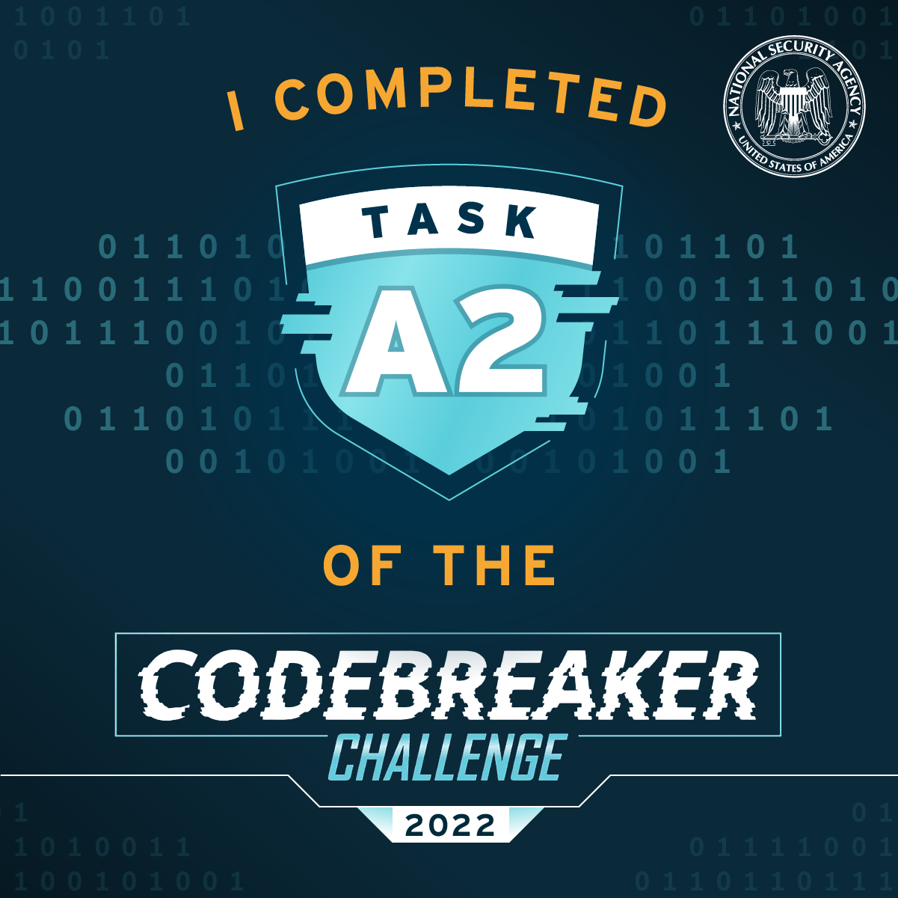

# Task A2
## Category: Computer Forensics/Packet Analysis
### Prompt:
Using the timestamp and IP address information from the VPN log, the FBI was able to identify a virtual server that the attacker used for staging their attack. They were able to obtain a warrant to search the server, but key files used in the attack were deleted.

Luckily, the company uses an intrusion detection system which stores packet logs. They were able to find an SSL session going to the staging server, and believe it may have been the attacker transferring over their tools.

The FBI hopes that these tools may provide a clue to the attacker's identity.
### Provided Materials:
1. Compressed tar archive containing the attackers tools (root.tar.bz)
2. PCAP file where the attacker downloaded their tools (session.pcap)
### Task Goal:
- username of the account the attacker used when they built their tools
## Steps:
The provided archive provides some context for what we're looking for in the pcap file. It contains a python file showing the method they used to download the tools:

```python
#!/usr/bin/env python3

# This script will create an anonymous, secure, temporary web server to transfer files over HTTPS.

import argparse
import datetime
import os
import random
import string
import subprocess
import sys

try:
    import libfaketime
except ImportError:
    subprocess.run(f'{sys.executable} -m pip install --user libfaketime', shell=True)
    import libfaketime


p = argparse.ArgumentParser()
p.add_argument('port', type=int)
args = p.parse_args()

certfile = '.cert.pem'
randoff = datetime.timedelta(seconds=random.randrange(3 * 365 * 24 * 3600))
dt = datetime.datetime.strptime('2017-01-01 00:00:00', '%Y-%m-%d %H:%M:%S') + randoff
env = libfaketime.get_reload_information()[1]
env['FAKETIME'] = dt.strftime('%Y-%m-%d %H:%M:%S')
cn = ''.join(c for c in random.choices(string.ascii_lowercase, k=12))
subprocess.run(
    f'openssl req -x509 -out {certfile} -new -keyout {certfile} -newkey rsa:4096 -batch -nodes -subj /CN={cn} -days 3650',
    env=env,
    stderr=subprocess.DEVNULL,
    check=True,
    shell=True)
subprocess.run(f'openssl x509 -noout -text -in {certfile}', shell=True)
print(f'Running openssl HTTPS server on port {args.port}')
os.execlp('openssl', 'openssl', 's_server', '-accept', str(args.port), '-cert', certfile, '-tls1_2', '-cipher', 'AES256-GCM-SHA384', '-WWW')
```

Using `ls -a` also shows some interesting files:



This tells us we are looking for a file called tools.tar in the session file. There is also a .cert.pem that would allow for decrypting the TLS traffic in wireshark. With this information, finding the username is pretty trivial with some basic wireshark knowledge. First, the cert.pem file is added to the TLS RSA keys:



Then, looking in wireshark for a GET request for tools.tar and following the TLS stream shows the username:




