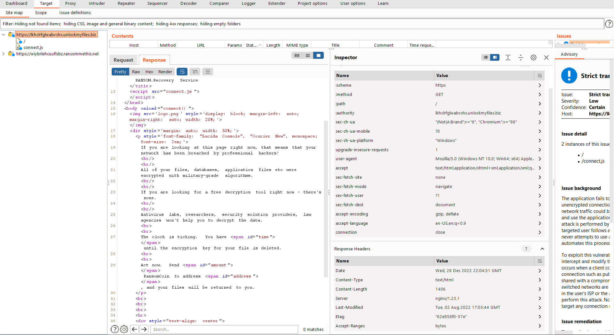
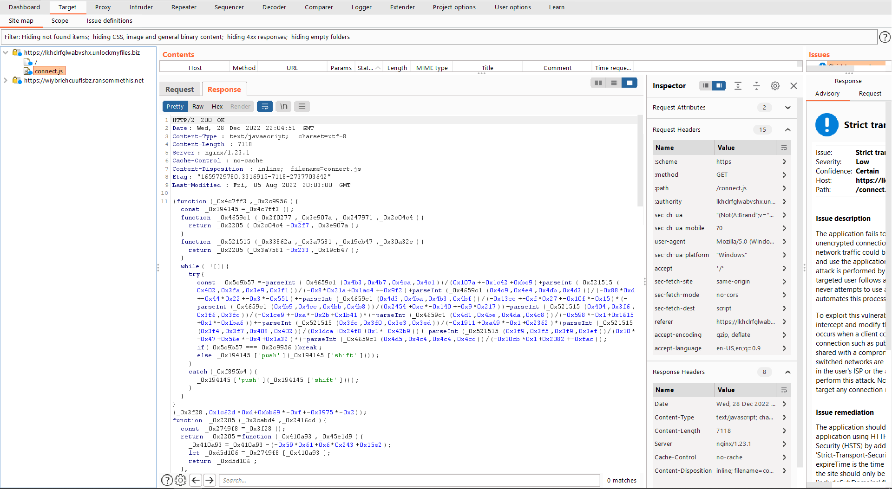

# Task B1
## Category: Reverse Engineering/Web Analysis
### Prompt:
"The attacker left a file with a ransom demand, which points to a site where they're demanding payment to release the victim's files.

We suspect that the attacker may not have been acting entirely on their own. There may be a connection between the attacker and a larger ransomware-as-a-service ring.

Analyze the demand site, and see if you can find a connection to another ransomware-related site."
### Provided Materials:
1. Ransom note (YOUR_FILES_ARE_SAFE.txt)
### Task Goal:
- Domain name of the associated site
## Steps:
While you can do all of this in the browser developer tools, I chose to use Burp Suite as it makes the process a lot easier.
Just by analyzing the network connections in the browser or looking at the targets in Burp Suite, you can see the associated domain:



To understand where this domain comes from, we have to look at `connect.js`:



This is obviously obfuscated javascript, and I ran it through a beautifier and put it into an IDE to make refactoring easier.
The main function, `connect()` is the one that reaches out to the associated URL:
```js
function connect() {
    return new Promise((_0x5a32f4, _0x18f0ba) => {
        function _0x5db2c6(_0x373796, _0x1db329, _0x14b500, _0xd74acd) {
            return _0x2205(_0x373796 - 0x38c, _0x14b500);
        }

        function _0x2b97c3(_0x5a1daf, _0x2dfeff, _0x107a08, _0x43802a) {
            return _0x2205(_0x2dfeff - -0x158, _0x5a1daf);
        }
        getJSON(_0x2b97c3(0x67, 0x73, 0x7c, 0x68) + _0x2b97c3(0x7b, 0x7b, 0x80, 0x7b) + _0x5db2c6(0x569, 0x573, 0x57b, 0x57d) + 'mmethis.ne' + _0x2b97c3(0x73, 0x7f, 0x6c, 0x93) + 'id=28733', function(_0x37b390, _0x48d4bd) {
            function _0xc95ad5(_0x262516, _0x586b18, _0x107e3f, _0xa76455) {
                return _0x5db2c6(_0xa76455 - -0x33d, _0x586b18 - 0x1c7, _0x262516, _0xa76455 - 0x190);
            }

            function _0x34072f(_0x16db36, _0x1e33ce, _0x269dc5, _0x28e9ef) {
                return _0x2b97c3(_0x269dc5, _0x1e33ce - -0xff, _0x269dc5 - 0xc0, _0x28e9ef - 0xb7);
            }
            _0x37b390 !== null ? alert(_0x34072f(-0x7a, -0x8b, -0x79, -0x81) + _0x34072f(-0x84, -0x85, -0x79, -0x77) + ':\x20' + _0x37b390) : (_0x5a32f4(_0x48d4bd), document[_0xc95ad5(0x231, 0x235, 0x224, 0x230) + 'ById'](_0x34072f(-0xa5, -0x91, -0x9d, -0x92))[_0xc95ad5(0x213, 0x220, 0x20b, 0x21f)] = time(_0x48d4bd[_0xc95ad5(0x23a, 0x22b, 0x22a, 0x231)]), document['getElement' + 'ById'](_0xc95ad5(0x1fb, 0x1ff, 0x221, 0x20f))[_0xc95ad5(0x20e, 0x216, 0x22a, 0x21f)] = _0x48d4bd[_0xc95ad5(0x205, 0x214, 0x208, 0x20f)], document['getElement' + _0x34072f(-0x81, -0x8a, -0x8d, -0x7b)](_0xc95ad5(0x215, 0x21b, 0x22e, 0x229))['innerHTML'] = _0x48d4bd[_0xc95ad5(0x22f, 0x236, 0x232, 0x229)], exp_date = _0x48d4bd[_0x34072f(-0x71, -0x75, -0x68, -0x71)]);
        });
    });
};
```

The getJSON lines include a few URL fragments such as part of a domain and TLD, as well as a parameter:
"mmethis.ne", "id=28733". A fragment of the protocol and subdomain ("https://wi") can be seen in a function containing a partial list of unobfuscated strings:

```js
function _0x3f28() {
    const _0x311263 = ['apply', '248MBaaHS', 'GET', 'constructo', 'amount', '10415pSmUmZ', '8291060RPHHtA', '6LfMxQT', '333513rwhDlE', 'round', 'time', '2573432lbrosr', '412lbBIug', 'send', '450220SLgjhE', 'https://wi', 'something\x20', 'ById', 'status', 'search', 'innerHTML', '7423465fJpOGc', 'went\x20wrong', 'ybrlehcuuf', 'json', '11YQEzZd', 'getTime', 't/demand?c', 'toString', 'floor', 'address', 'open', '3451113GgrGuZ', 'lsbz.ranso', 'response', '(((.+)+)+)', '\x20days\x20', 'getElement', 'exp_date', 'responseTy'];
    _0x3f28 = function() {
        return _0x311263;
    };
    return _0x3f28();
}
// Refactored:
function get_str_list() {
    const str_list = ['apply', '248MBaaHS', 'GET', 'constructo', 'amount', '10415pSmUmZ', '8291060RPHHtA', '6LfMxQT', '333513rwhDlE', 'round', 'time', '2573432lbrosr', '412lbBIug', 'send', '450220SLgjhE', 'https://wi', 'something\x20', 'ById', 'status', 'search', 'innerHTML', '7423465fJpOGc', 'went\x20wrong', 'ybrlehcuuf', 'json', '11YQEzZd', 'getTime', 't/demand?c', 'toString', 'floor', 'address', 'open', '3451113GgrGuZ', 'lsbz.ranso', 'response', '(((.+)+)+)', '\x20days\x20', 'getElement', 'exp_date', 'responseTy'];
    get_str_list = function() {
        return str_list;
    };
    return get_str_list();
}
```

To fully reconstruct the URL, the other portions obfuscated away in functions have to be reverse engineering.
