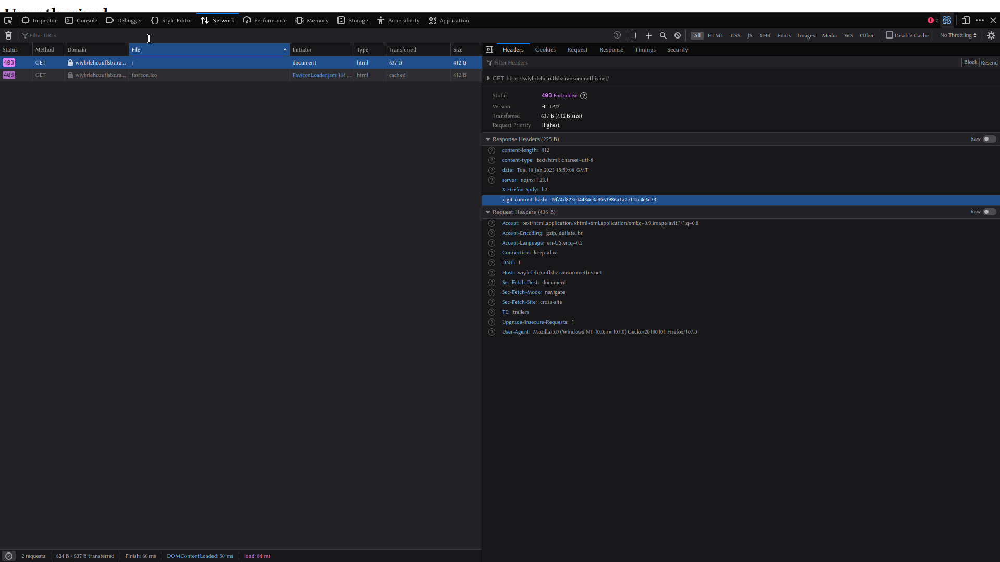

# Task B2
## Category: Web Hacking/Redacted
### Prompt:
It looks like the backend site you discovered has some security features to prevent you from snooping. They must have hidden the login page away somewhere hard to guess.

Analyze the backend site, and find the URL to the login page.

Hint: this group seems a bit sloppy. They might be exposing more than they intend to.
### Provided Materials:
- None
### Task Goal:
- The URL of the login page
### Steps:
Taking a look at the URL gained in task b1 shows an unauthorized page:


The HTML source is minimal and uninteresting, and since we know brute forcing directories isn't an option, the logical place to examine is the network request. The request contains a non-standard header called x-git-commit-hash, indicating the website is hosting a git repo:



We can verify this by either requesting the /.git/ directory (though directory listing is disabled) or by directly requesting /.git/HEAD:


Now that we know there is a git repo hosted on the site, a script such as GitTools can be used to dump the contents locally:


GitTools also includes an extractor to parse the files and repair any damaged paths:


Now we have access to the exposed python source code of the website, allowing us to see that they use a hardcoded path key to obfuscate important URLS:

```python
def expected_pathkey():
        return "yijcwjpcebqqaszt"

@app.route("/", defaults={'pathkey': '', 'path': ''}, methods=['GET', 'POST'])
@app.route("/<path:pathkey>", defaults={'path': ''}, methods=['GET', 'POST'])
@app.route("/<path:pathkey>/<path:path>", methods=['GET', 'POST'])
def pathkey_route(pathkey, path):
        if pathkey.endswith('/'):
                # Deal with weird normalization
                pathkey = pathkey[:-1]
                path = '/' + path

        # Super secret path that no one will ever guess!
        if pathkey != expected_pathkey():
                return render_template('unauthorized.html'), 403
        # Allow access to the login page, even if they're not logged in
        if path == 'login':
                return loginpage()
        # Check if they're logged in.
        try:
                uid = util.get_uid()
        except util.InvalidTokenException:
                return redirect(f"/{pathkey}/login", 302)

        # At this point, they have a valid login token
        if path == "":
                return redirect(f"/{pathkey}/", 302)
        elif path == "/" or path == 'home':
                return navpage()
        elif path == 'adminlist':
                return adminlist()
        elif path == 'userinfo':
                return userinfo()
        elif path == 'forum':
                return forum()
        elif path == 'lock':
                return lock()
        elif path == 'unlock':
                return unlock()
        # Admin only functions beyond this point
        elif path == 'admin':
                return util.check_admin(admin)
        elif path == 'fetchlog':
                return util.check_admin(fetchlog)
        elif path == 'credit':
                return util.check_admin(credit)
        # Default
        return render_template('404.html'), 404
```

This makes the login URL https://wiybrlehcuuflsbz.ransommethis.net/yijcwjpcebqqaszt/login


